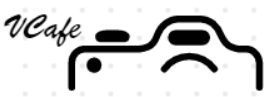
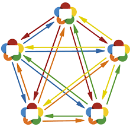
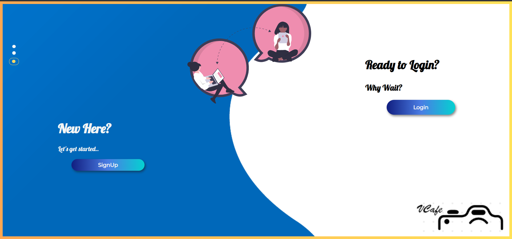
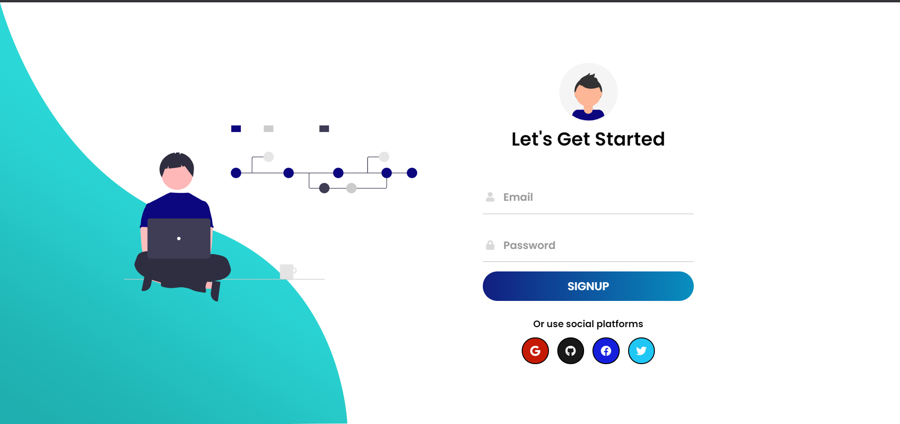
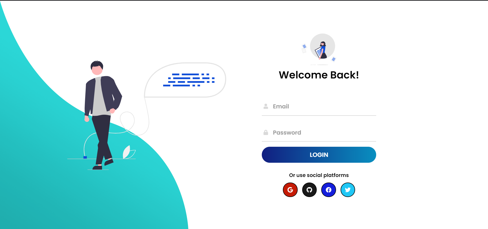
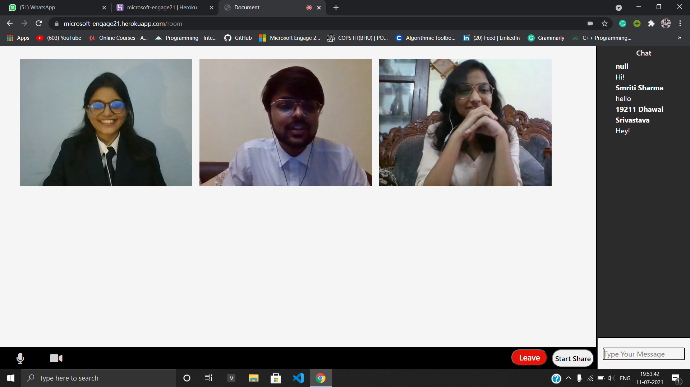

# A Clone of Microsoft Teams

 This is a Web Application that uses Firebase for authentication and WebRTC for Video Conferencing. 

<!-- PROJECT LOGO -->
<br/>
<p align="center">
    

   <h3 align="center">Microsoft Engage 2021 Challenge</h3>
   <p align ="center">
   <br/>
   <!-- Youtube Video Link -->
   <a href=" ">View Demo</a>
   .
   <a href="https://microsoft-engage21.herokuapp.com/ ">Website</a>
   </p>
   </p>


   <!-- TABLE OF CONTENT -->
   <details open="open">
   <summary>Table of Contents</summary>
   <ol>
    <li>
     <a href="#about-the-project">About The Project</a>
     <ul>
      <li><a href="#development-methodology">Development Methodology</a></li>
       </ul>
      <ul>
        <li><a href="#built-with">Built With</a></li>
      </ul>
    </li>
    <li><a href="#architecture">Architecture</a>
    <li>
      <a href="#getting-started">Getting Started</a>
      <ul>
        <li><a href="#pre-requisites">Pre-requisites</a></li>
          <li><a href="#acknowledgements">Acknowledgements</a></li>
      </ul>
    </li>
    <li><a href="#snapshots">Snapshots</a></li>
    <li><a href="#scope">Scope</a></li>
    <li><a href="#contact">Contact</a></li>
  </ol>
</details>


<!-- ABOUT THE PROJECT -->
## **About the Project**
Engage 2021 is a Engagement and Mentorship program created by Microsoft engineers, in association with Ace Hacker team, for engineering students.Through this initiative, students get a chance to be mentored by Microsoft and be a part of AMA Sessions, Webinars and Leader talks delivered by Microsoft employees. The challenge was to **build a Microsoft Teams Clone** . It should be a fully functional prototype with at least one mandatory functionality - *a minimum of two participants should be able connect with each other and have a video conversation*.[Microsoft Engage 2021](https://microsoft.acehacker.com/engage2021/?mc_cid=51cf8705a5&mc_eid=e7a7568555#challenge)


### **Development Methodology :**

### Scrum Methodology

Scrum is an **Agile** development methodology used in the development of software based on an iterative and incremental processes. Each iteration consists of two to four week sprints, where each sprint’s goal is to build the most important features first and come out with a potentially deliverable product.

### **Sprint Map**
 Below points provides insight to sprint wise progress and bugs:

- #### **Week 1** : 
    1.  Learn more about Backend in Web-developement.
    2.  Decide tech stack and architecture.
    3.  Learn **NodeJs** for server-side rendering.
    4.  Learn about Git and GitHub.

- #### **Week 2** : 
    1.  Work on the User Interface.
    2.  Complete Sign-in and Sign-up
    3.  Exploration about Firebase and WebRTC.
    4.  Authenticate email and password.
    5.  Research about other features.
    6.  Implementation of WebRTC.
     ***Bugs* : Authentication using Twitter and Facebook(Privacy Policy of these platforms).**

- #### **Week 3** :
    1.  Add extra features like mute, camera off.
    2.  Improve the User Interface.
    3.  Improving the WebRTC Handshake Connection.
    4.  Add the Screen Share feature.
    ***Bugs* : Not working globally, Screen Share cannot be viewed on FullScreen.**

- #### **Week 4** :  
    1.  Add logo.
    2.  Server deployment on Heroku.
    3.  Global working(Testing on different networks).
    4.  Add chat feature during video call.
    4.  Try to implement adopt feature.
    5.  Update README.
    6.  Create demo video.
    ***Bugs* : Globally not working on some ISPs.**


### **Built With**
* [Firebase](https://firebase.google.com/)
* [WebRTC](https://webrtc.org/)
* [Nodejs](https://nodejs.org/en/)

## **Architecture :**
Clone uses Peer to Peer mesh architecture. Mesh architecture provides group video call functionality. WebRTC is used for the real time media communication between devices. WebRTC is a fully peer-to-peer technology for the real-time exchange of audio, video, and data, with one central caveat. Making this into a group call in P2P translates into a mesh network, where every WebRTC client has a peer connection opened to all other clients directly. When dealing with WebRTC and indicating Peer to Peer mesh, the focus is almost always on media transport. The signaling still flows through servers as WebRTC doesn't provide signaling which is essential for establishing connection.
<p align="center">
   

Firstly, all users registers with the server. Once users have registered, they are redirected to the video calling page where they can connect and chat with each other.

<!-- GETTING STARTED -->
## **Getting Started**

### Pre-requisites
- [Basic setup of NodeJs](https://nodejs.org/en/docs/guides/getting-started-guide/)
- [Basic setup of VSCode](https://code.visualstudio.com/download)
- [Basic setup of ExpressJs](https://expressjs.com/en/starter/installing.html)

### Installation

1. Clone the repo
```sh
git clone https://github.com/Simi06/Microsoft_Engage.git
```

2. If you wish to use the Local Server instead of the Global One(default), Run the [server.js] file using the command *node server.js* in the terminal. The server will listen on PORT 3030 (localhost:3030).

<!-- DEPENDENCIES -->
## Dependencies
- [nodemon](https://www.npmjs.com/package/nodemon)
- [cors](https://www.npmjs.com/package/cors)
- [ejs](https://www.npmjs.com/package/ejs)
- [express](https://www.npmjs.com/package/express)
- [firebase](https://www.npmjs.com/package/firebase)
- [peer](https://www.npmjs.com/package/peer)
- [peerJs](https://www.npmjs.com/package/peerjs)
- [socket.io](https://www.npmjs.com/package/socket.io)


## **Snapshots :**







<br/>

<!-- ROADMAP -->
## Scope
### Features
- Sign-in and sign-up authentication via Email.
- Authentication using Google,Github,Facebook and Twitter.
- Connectivity for 4-5 participants.
- Participants can Mute and Unmute.
- Participants can switch their videos on and off.
- Allow chat during video call.
- ScreenShare by the meeting organizer.


### Possible Improvements
- Multiple Rooms can be created.
- A random Room ID generator can be implemented or the organizer can make a Room ID of his choice.
- Screen Share can be improved to be viewed on full screen for all the participants.
- Share link/Code feature can be added.

<!-- CONTACT -->
## Contact
- Email : smriti.sharma.ece19@itbhu.ac.in
- Project : [https://github.com/Simi06/Microsoft_Engage.git](https://github.com/Simi06/Microsoft_Engage.git)
